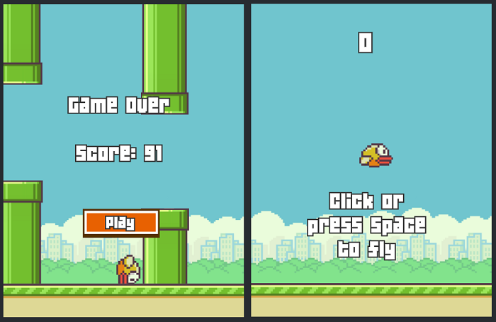

# FlappyBird

flappy bird game with javascript and P5.js library

- P5.js 1.4.0 _for make game loop_
- Webpack 5 _for module bundling_

[Live Demo](https://barzin144.github.io/FlappyBird/)

## Available Scripts

In the project directory, you can run:

### `npm start`

Runs the app in the development mode. 
Open [http://localhost:8081](http://localhost:8081) to view it in the browser.

### `npm run build`

Builds the app for production to the `build` folder. 
It correctly bundles React in production mode and optimizes the build for the best performance.

The build is minified and the filenames include the hashes. 
Your app is ready to be deployed!

